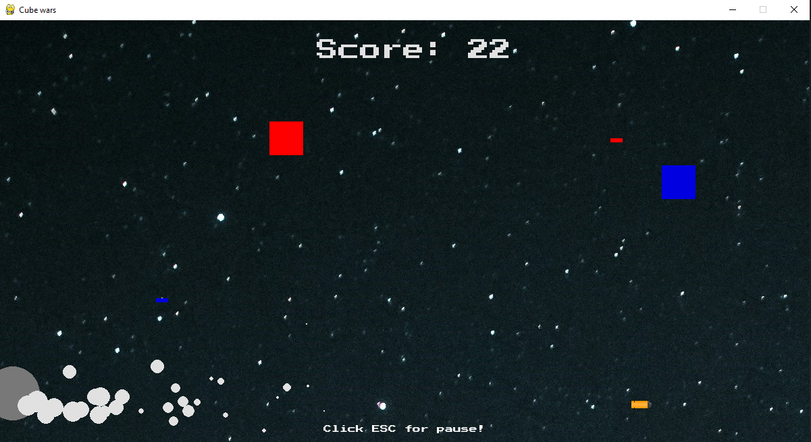

# 🧩 Cube wars
A small 2D game made with python

## 🤔 Why Did I Make This?
- This was my first-ever project where I could put my Python knowledge to the test.
- I enjoy making games

## 🛠️ Main Features
- Player movement
- Shooting waves of enemies
- Score system
- Simple pixel graphic
### 🧠 Bonus features
- Power-ups (e.g., fast-shotting, shield)
- High score saving
- Multiple enemy types and behaviors

## 🎮 Controls
- **WSAD / Arrow Keys** – Move the player
- **Spave** – Shooting 
- **Esc** – Pause the game

## 🖼️ Gameplay Screenshot

## ⚙️ Tech Stack
- Language: Python
- Library : PyGame 
- Version Control: GitHub  

## 🔮 Future Plans
- Add more enemies
- Improve design

## 🙏 Credits
Thanks to FreeSound.org for providing free music and sound effects for this game:  
- [freesound](https://freesound.org/)

## 👨‍💻 Author
- Filiprian  
- [My GitHub](https://github.com/Filiprian)

> This first project gave me a lot of motivation and knowledge to continue pursuing game development.
